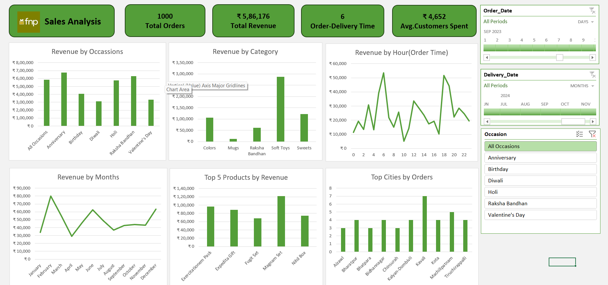

# 📊 FNP Sales Analysis
 

 ## 📌 Problem Statement
 FNP(Ferns and Petals) that specializes in sending gifts for various occassions like Diwali, Raksha Bandhan, Holi, Valentine's Day, Birthdays and Anniversaries. The dataset contains details about the products, orders, customers and relevant dates. The task is to analyze this dataset to uncover key insights related to sales trends, customer behaviour and product performance.

## 🔍 Project Overview
This project presents a detailed Excel dashboard analyzing FNP's sales data. It covers key performance indicators (KPIs), occasion-wise trends, product category performance, and customer behavior insights to support strategic decision-making.

## 📁 Files Included
- ```FNP_Sales_Analysis.xlsx```: Main Excel dashboard

- ```Project_Summary.pdf```: Executive summary with key insights and analysis

- ```images/```: Screenshots of the dashboard for quick preview

## 🧠 Key Insights
- Anniversary generates the highest revenue among occasions.
- Soft Toys are the top-performing product category.
- Peak order placements occur between 5 AM – 8 AM and 6 PM.
- March records the highest monthly revenue.
- Top cities for orders include Kavali, Kota, and Trichy.

## 🖼️ Dashboard Preview



## 📄 Project Summary
For a detailed breakdown, read the full executive summary:[Project_Summary.pdf](Project_Summary.pdf)

## 🔧 Tools Used
- Microsoft Excel
- Pivot Tables, Charts, Slicers, Conditional Formatting

